# Development and Open-Source Proposal of the Impact on Daily Life Depression Inventory (IDL-DI) for Personal Self-Assessment

---

**Authors:** Sam Garfield & P-Tech

**Draft Date:** December 10, 2023

---

## 1. Introduction

Depression is a global health concern that profoundly affects an individual’s emotional well-being and daily functionality. Though clinical assessments have advanced, accessibility remains limited by cost, geographic reach, and social stigma. To address these barriers, we introduce the Impact on Daily Life Depression Inventory (IDL-DI)—a self-assessment tool designed to measure depressive symptoms' influence on daily activities. This open-source instrument invites community engagement, fostering personal insight and bridging the gap to professional care.

---

## 2. Literature Review and Considerations

The expansion of mental health resources and tools is a pressing necessity given the widespread impact of depressive disorders across populations globally. The literature review for the Impact on Daily Life Depression Inventory (IDL-DI) encompasses existing empirical studies, psychometric evaluations of established instruments, and the emerging discourse on the inclusion of open-source methodologies in mental health assessments.

### 2.1 Scope and Prevalence of Depression

Depression is a pervasive mental health condition characterized by its heterogeneity and multifactorial nature. Epidemiological studies demonstrate its high prevalence, attributing significant disability and burden to it, as reflected in the Global Burden of Disease Study. The literature notes that depression often co-occurs with several chronic diseases, amplifying the healthcare challenge it poses.

### 2.2 Established Psychometric Tools

Classic psychometric instruments such as the Beck Depression Inventory-II (BDI-II) and the Hamilton Depression Rating Scale (HDRS) serve foundational roles in the definition and measurement of depressive symptomatology. Their development followed rigorous protocols involving iterative item analysis, reliability assessment, and validation against clinical diagnoses. However, the literature indicates a gap between clinical assessment and the subjective quantification of depression's daily impact, which the IDL-DI aims to bridge.

### 2.3 Accessibility Challenges

Review of the current landscape elucidates challenges such as the cost of proprietary tools, resource constraints in low-income areas, and socio-cultural barriers preventing widespread adoption. Many individuals lack access to assessments due to these constraints, leading to a gap in early identification and intervention. Furthermore, stigmatization continues to be a significant hindrance to engagement with mental health services, a factor the IDL-DI seeks to mitigate by promoting a user-friendly and private means of self-assessment.

### 2.4 Technological Integration in Assessments

Rapid advancements in technology infuse the literature with explorations of digital health solutions. Digital platforms exhibit potential in delivering psychological assessments with enhanced reach and scalability. The intersection of technology and psychological tools, as explored in recent meta-analyses, presents an opportunity for innovation in how assessments are administered, analyzed, and integrated into care pathways.

### 2.5 Open-Source Models in Healthcare

A novel view within the literature is the advocacy for open-source models as means for health tool dissemination. Analogous to their impact on software development, open-source principles promote collective improvement, transparency, and adaptability of health resources. An open-source approach could revolutionize mental health tools, making them more responsive to community needs and more reflective of a diverse user base.

### 2.6 Ethical and Legal Frameworks

Ethics and privacy considerations are crucial when developing health assessment tools. Current literature presents a discourse on the ethical implications of digital self-assessment tools, particularly concerning data privacy, informed consent, and appropriate response mechanisms for high-risk individuals. The literature emphasizes user autonomy while underscoring the need for clinical oversight and crisis management strategies.

### 2.7 Empirical Study Considerations

For the proposed empirical study of the IDL-DI, the literature underlines the importance of a sound methodological design. This includes establishing normative data, performing cross-validation studies, and ensuring cultural competence in tool development. The research priority is to address both internal (e.g., construct validity) and external (e.g., ecological validity) validity factors.

### 2.8 Gap Analysis

A critical examination reveals a notable gap: the lack of tools that accurately reflect the subjective impact of depression on day-to-day life. The IDL-DI, with its user-centered design, seeks to fill this void by offering a tool that emphasizes personal experience and functional impact.

### Considerations Not Yet Addressed

Throughout our discussions, additional considerations have surfaced. These include:

- **The Role of User Experience Design**: Considering how the interface and user interaction design of digital assessment tools can affect the accuracy of self-reporting.
- **The Inclusion of Diverse Populations in Testing**: Prioritizing diverse representation to ensure the tool's applicability across various socio-economic, cultural, and demographic groups.
- **Integration with Health Records**: Looking at interoperability with existing digital health record systems to facilitate continuity of care.
- **Longitudinal Studies**: Considering the value of longitudinal study designs to track the validity and reliability of the IDL-DI over time.

In summary, the literature review and additional considerations lay a substantive foundation for the ongoing development of the IDL-DI. Both the review and these considerations call for an empirical study that respects the ethics, complexity, and cultural richness of the task at hand—creating a psychometrically sound tool that is available to all as a beacon of open-source ethos in mental healthcare.

---

## 3. Methodology

The methodology behind the creation of the Impact on Daily Life Depression Inventory (IDL-DI) is rooted in the intersection of clinical understanding and personal reflection on mental health. The inventory is devised to embody a user-centric approach, enabling individuals to conduct self-assessments that provide subjective insights into the impact of depression on their daily life.

### 3.1 Theoretical Framework

The development of IDL-DI began with an extensive literature review, scrutinizing existing validated depression scales, meta-analyses of depression symptomatology, and the latest DSM and ICD classifications. Aware that depression manifests in a multitude of dimensions—cognitive, affective, and somatic—the IDL-DI was conceived to encompass this range, emphasizing the functional repercussions on everyday activities, work performance, and social interactions.

### 3.2 Collaborative Item Development

A purposive, multidisciplinary panel conducted the initial phase of item development. This panel included clinical psychologists, psychiatric practitioners, researchers specializing in psychometrics, and individuals with lived experiences of depression. The collaborative effort ensured a holistic perspective in item selection and a focus on community needs. 

A Delphi method was employed to attain consensus among panelists regarding item relevance and clarity. The use of iterative rounds allowed dissent and agreement to shape the inventory iteratively, resulting in items that carry empirical heft and experiential authenticity.

### 3.3 Response Options Design

The IDL-DI employs a 5-point Likert-type scale for each item, buttressed by descriptors that qualify the frequency ("Never" to "Always") and impact (e.g., "without impact" to "severely disruptive"). Symptoms are anchored to functional outcomes, thus underscoring the inventory's emphasis on daily life impairment.

### 3.4 Scoring System and Categories

The scoring system of the IDL-DI is crafted to delineate a gradient of depressive impact, with scores correlating to categories ranging from "No or Minimal Impact" to "Severely Disabling Impact." This system mirrors the intention of creating a nuanced representation of depression's severity tied to tangible daily consequences, facilitating self-assessment and potential early intervention.

### 3.5 Pilot Testing and Iterative Refinement

To calibrate the IDL-DI's applicability and comprehensiveness, pilot tests were conducted within varied demographic groups. Feedback from these sessions was vital in refining the language, scope, and resonance of each item. Cognitive interviewing techniques complemented this phase to garner qualitative insights into how respondents interpret questions, revealing areas for adjustment in wording and structure to optimize self-administration of the questionnaire.

### 3.6 Digital Accessibility and Format

Considering the digital-first approach of many contemporary self-assessment tools, the IDL-DI was formatted to be both a physical printout and an interactive digital questionnaire. Special attention was given to ensure compliance with the Web Content Accessibility Guidelines (WCAG) to accommodate users with disabilities. Efforts were made to ensure digital compatibility without compromising the intent or structure of the inventory. This dual-format design accommodates diverse user preferences and accessibility considerations.


### 3.7 Ethical Considerations

Ethical considerations were paramount throughout the development process. Protocols were established to inform users about the non-diagnostic nature of the tool, emphasizing the importance of professional consultation for mental health concerns. Privacy measures were also addressed, ensuring user anonymity and data security in digital implementations of the IDL-DI.

### 3.8 Pathway for Community Involvement

A pathway for continuous community contribution was embedded into the design methodology. Open-source distribution invites further refinement and validation, offering the possibility for the IDL-DI to evolve with collaborative input and shared ownership reflective of diverse, global perspectives on mental health.

The meticulous methodology underpinning the IDL-DI positions it as an adaptable, open-source instrument aimed at enhancing personal insight into depression's impact—a tool intentionally crafted for communal development and empathetic self-exploration.

---

## 4. Proposed Inventory

The Impact on Daily Life Depression Inventory (IDL-DI) encapsulates ten meticulously crafted items, each probing a distinctive symptom of depression and its associated impact on day-to-day activities. The inventory is structured to render a dual assessment—quantifying both symptom frequency and its disruptive toll on normal functioning.

### 4.1 Inventory Structure

Each item is conceived as a statement that respondents evaluate against their experiences within the last week. Choices range from 0 (denoting absence of the symptom or no impact on daily life) to 4 (signifying constant presence and severe interference). The IDL-DI ensures an empathetic tone, employing lay language for accessibility while maintaining clinical relevance.

### 4.2 Item Selection Rationale

The selection of items was predicated on comprehensive criteria that prioritized functional impairment. Core depressive symptoms, such as feelings of sadness and anhedonia, were juxtaposed with cognitive (concentration difficulties), psychomotor (changes in activity levels), and somatic symptoms (sleep and appetite changes). Additional items assessing the sense of worthlessness, fatigue, avoidance of social situations, and thoughts of death or suicide were included to capture the broad spectrum of depressive manifestations.

The choice to center on the impact of symptoms on day-to-day functionality arises from the inventory's goal—to assist users in recognizing depressive patterns that may warrant professional attention. This focus diverges from traditional inventories that may be structured around symptom severity in isolation from the nuances of daily living.

### 4.3 Rationale Behind Response Options

The Response Options Design is a core component of IDL-DI, approached with meticulous care to maintain straightforward communication. Each option aligns with both the Diagnostic and Statistical Manual of Mental Disorders (DSM) and the lived experience of those with depression, enabling users to choose responses that resonate with their reality and provide actionable information.

For example, rather than merely stating "I feel tired," an option might read: "I often feel tired, impacting my ability to complete routine tasks." Such specificity bridges the gap between clinical language and personal experience, offering a window into the user's life influenced by depressive symptoms.

### 4.4 Scoring and Interpretation

Scoring in the IDL-DI is transparent and user-friendly. Total scores are categorized into five distinct bands of depressive impact, undergirded by the rationale that higher scores correlate with greater interference in daily functioning. This establishes an index of urgency for seeking professional advice, especially at higher score ranges.

The rationale for the scoring system and its categories hinges on the premise that self-assessment tools should provide clear, immediate feedback. Users are thus equipped with an understanding of their scores' implications on their day-to-day lives and are encouraged to use this knowledge in their broader mental health management strategies.

### 4.5 Visual and Graphical Aids

To aid comprehension and retention, the IDL-DI integrates visual elements within its digital format. Each category is color-coded, with associated scores visually represented in the questionnaire's margins. An optional, supplementary graphic illustrates the inventory structure and scoring bands for users who prefer visual learning.

### 4.6 Accessibility and Distribution

The IDL-DI will be distributed both as a printable paper questionnaire and an interactive digital format, ensuring accessibility to a wide demographic. It is optimized for clarity in both formats, adhering to best practices in legibility, navigability, and user experience design.

---

*Note: Each response within the IDL-DI correlates with a numerical score, facilitating a self-scoring system that allows users to determine the potential severity of their depressive symptoms. The inventory also includes an "N/A" option for items that may not apply, ensuring that each score genuinely reflects the individual's experience.* 

The IDL-DI, conceived as an open-source proposition, invites academic scrutiny, clinical exploration, and community engagement, advocating for its potential as a dynamic tool in the evolving landscape of mental health self-assessment. The detailed presentation of the inventory embodies the meticulous care and consideration underpinning its development, reinforcing its envisioned role as a means to empower individuals in their mental health journeys.

---

## 5. Potential Value of Open-Source Tools

In the contemporary landscape of psychological assessment, the advent of open-source tools presents a transformative potential unmatched by traditional proprietary methods. The IDL-DI, as an open-source contribution, stands at the vanguard of this movement—its value extending beyond its immediate utility as a self-assessment instrument to its broader implications in community engagement, innovation, and transparency in tool development.

### 5.1 Democratization of Mental Health Resources

The open-source model inherently democratizes access to mental health resources. By making the IDL-DI's code and content freely accessible, we dismantle barriers to entry that often encumber the distribution and utilization of psychological assessments. This extends both to individuals seeking self-insight and professionals advocating for mental health advancements. As users from diverse backgrounds contribute their experiences and expertise, the inventory evolves—increasing its cultural relevance and applicability.

### 5.2 Fostering Innovation and Collaboration

The collaborative nature of open-source projects is their lifeblood. By putting the IDL-DI into the hands of the community, we catalyze a development cycle fed by a multitude of perspectives—clinicians, researchers, software engineers, and end-users. Innovation flourishes in such an environment, where iterative improvement is driven not by a single entity but by a collective, drawing from a wellspring of shared knowledge and creativity.

### 5.3 Transparency and Continuous Improvement

Open-source projects operate under a mantle of transparency that fosters trust and accountability. The IDL-DI's codebase and all subsequent iterations are open for audit, critique, and enhancement. This transparency ensures that improvements are continual and that the inventory remains aligned with both emerging clinical research and user feedback. Improvements in code and content can be rapidly incorporated, making the IDL-DI a living document that reflects the most current understanding of depression and its impact on daily life.

### 5.4 The IDL-DI Software

The software we've developed to accompany the IDL-DI underscores the practical application of open-source principles. It is designed to facilitate the easy loading and administration of interviews and track users' results over time. Users are guided interactively through the assessment, with their responses scored and compiled into a historical chart that visually tracks their progress. This immediate feedback loop embodies the philosophy of open-source tools—putting power into the hands of users and providing actionable insights into their well-being.

The application is built with extensibility in mind, enabling contributors to add new interviews, modify existing ones, and tailor the software to specific needs. Its functionality encapsulates best practices in software engineering—modularity, scalability, and user-friendly design.

### 5.5 Community Empowerment and Accessibility

Providing the SAI platform and the IDL-DI as open-source offerings recognizes the inherent value in community empowerment. Accessibility extends beyond the availability of the tool to include the ease with which individuals can engage with it. By ensuring the software caters to non-clinical users—through clear interfaces, instructions, and feedback—it becomes a catalyst for increased mental health awareness and self-management. Community engagement is further enhanced by structured feedback mechanisms that allow users to offer insights and suggestions for improvement.


### 5.6 Future Directions and Research Integration

The release of the IDL-DI as an open-source tool is an invitation for its adoption within research settings. The open-source framework enables a seamless integration of research findings into the tool, promising the potential for rapid dissemination of new insights into assessment methodologies. Academic and clinical research can draw from the real-world data collected through the SAI platform, driving forward the validation process and refining the tool's accuracy and reliability.

---

In conclusion, the IDL-DI's open-source proposition aligns with a transformative vision for mental health resources—a vision characterized by accessibility, collaboration, and adaptability. By offering the software to the community, we lay a foundation for an inclusive approach to self-assessment that values user input as much as clinical expertise, heralding a new paradigm in mental health empowerment.
---

## 6. Ethical Considerations and Caveats

The ethical stewardship of the Impact on Daily Life Depression Inventory (IDL-DI) is paramount, given the delicate nature of mental health assessment and the implications of its findings. Introducing the IDL-DI as an open-source tool positions it uniquely in the public domain, which introduces a multifaceted set of ethical considerations.

### 6.1 Informed Consent and User Understanding

While the IDL-DI offers insights into the impact of depression on daily activities, it is crucial to emphasize to users that the tool is not a substitute for professional medical evaluation or diagnosis. Clear, accessible explanations of the purpose, use, and limitations of the IDL-DI must be presented to users, ensuring informed consent. This includes full disclosure regarding the non-clinical validation of the instrument and that the scoring system is subject to further research and refinement.

### 6.2 Data Privacy and Security

As an open-source digital tool, the IDL-DI must adhere to stringent data privacy protocols. Users' responses must be anonymized, encrypted, and securely stored, with transparency about data usage. Provisions should be made for users to access their data and be fully aware of their rights, including the right to withdraw their data from the system. Any future development should prioritize the development of secure data infrastructure, possibly utilizing blockchain or other advanced security technologies to reinforce trust in the system's integrity.

### 6.3 Sensitivity to Distress and Crisis Response

The inventory includes questions that may evoke distress, such as those concerning suicidal ideation. It is ethically incumbent to implement an automated system that identifies and responds to high-risk responses. This could involve providing immediate on-screen resources, crisis intervention contacts, or referral information for mental health services, localized to the user's region, which would be triggered based on specific answers indicating severe distress or risk of self-harm.


### 6.4 Collaborative Validation and Community Oversight

Proposing the IDL-DI for further validation entails a robust, transparent collaborative process. This involves the setup of community oversight boards comprising both mental health professionals and laypersons, which would help steer the validation process, ensuring that it aligns not only with academic rigour but also with societal expectations and ethical norms.

### 6.5 Continuous Ethical Review

As the IDL-DI evolves, continuous ethical review is necessary. This includes periodic reassessment of privacy measures, consent processes, data management, and user interaction. Given the open-source nature of the tool, a dedicated ethics committee should be established to review contributions for ethical implications, especially as the tool gets incorporated into different cultural and social settings.

### 6.6 Addressing Bias and Inclusivity

Future work must concentrate on eliminating potential bias within the IDL-DI, ensuring it is inclusive and representative of diverse population groups. In-depth studies involving diverse demographics are needed to discover any unintentional biases in question phrasing, scoring interpretation, or interface design. Ensuring cultural sensitivity and inclusivity in language translation and adaptation will be vital in extending the IDL-DI's reach globally.

### 6.7 Caveats and Clinical Boundaries

Users must be cognizant of the IDL-DI's limitations. Caveats include its current lack of clinical validation, potential revisions that may affect how scores are interpreted, and the tool's inability to capture the full spectrum of depressive experience or replace clinical judgment. Messaging should reinforce the need for professional evaluation, especially for those experiencing acute or severe symptoms.

### 6.8 Proposals for Future Work

Future work involves setting a roadmap for empirical validation studies, including large-scale data collection, quantitative analysis, and adjustments based on findings. Collaborations with clinical research institutions can facilitate controlled studies that compare IDL-DI scores with established clinical assessments. The integration of machine learning algorithms presents the opportunity to refine scoring accuracy based on large datasets. Future iterations of the IDL-DI may include adaptive testing methodologies that dynamically adjust the inventory based on user responses.

```mermaid.js
flowchart TD
    A[Start] --> B[Phase 1: Preparation and Planning]
    
    B --> B1[Establish Oversight Committee]
    B --> B2[Define Study Objectives]
    B --> B3[Resource Mobilization]
    B --> B4[Develop Protocols]
    B --> B5[Technology and Platform Development]
    B --> B6[Pilot Study]
    
    A --> C[Phase 2: Data Collection]
    C --> C1[Recruitment and Informed Consent]
    C --> C2[Administration of IDL-DI]
    C --> C3[Data Management]
    
    A --> D[Phase 3: Data Analysis and Interpretation]
    D --> D1[Statistical Analysis]
    D --> D2[Cultural Appropriateness]
    D --> D3[Algorithm Development]
    
    A --> E[Phase 4: Feedback and Refinement]
    E --> E1[Community Feedback]
    E --> E2[Refine IDL-DI]
    E --> E3[Iterative Testing]
    
    A --> F[Phase 5: Documentation and Publication]
    F --> F1[Document Findings]
    F --> F2[Academic and Community Publication]
    F --> F3[Open Source Contribution]
    
    A --> G[Phase 6: Ongoing Development]
    G --> G1[Continuous Improvement]
    G --> G2[Expansion]
    G --> G3[Global Collaboration]
    
    A --> H[Phase 7: Integration and Application]
    H --> H1[Clinical Integration]
    H --> H2[Technological Advancements]
    H --> H3[Policy and Advocacy]
```


```
Developing a roadmap for empirical study of the Impact on Daily Life Depression Inventory (IDL-DI) under a community-driven initiative involves collaboration, planning, and the application of rigorous scientific methods. The following roadmap outlines the key phases and steps that could be taken by the community to validate and improve the IDL-DI.

### Phase 1: Preparation and Planning

**1.1. Establish an Oversight Committee**
- Form a committee with diverse stakeholders, including mental health practitioners, researchers, ethicists, and representatives from different cultural backgrounds.
  
**1.2. Define Study Objectives**
- Clearly outline goals such as validating reliability, determining validity, and ensuring cultural and demographic applicability.
  
**1.3. Resource Mobilization**
- Identify funding sources, partnerships, and volunteer pools.
  
**1.4. Develop Protocols**
- Create research protocols and ethical guidelines for the study.
  
**1.5. Technology and Platform Development**
- Ensure software for administering the IDL-DI and collecting data is robust, secure, and adheres to privacy standards.
  
**1.6. Pilot Study**
- Conduct a small-scale pilot study to test and refine the research protocols and technology platforms.

### Phase 2: Data Collection

**2.1. Recruitment and Informed Consent**
- Launch a campaign to recruit a diverse participant pool.
- Implement informed consent procedures that inform participants of study risks, benefits, and data use.
  
**2.2. Administration of IDL-DI**
- Deploy the IDL-DI to participants through secure, accessible digital platforms or in-person assessments where digital access is limited.
  
**2.3. Data Management**
- Securely manage and store data, ensuring anonymity and confidentiality.

### Phase 3: Data Analysis and Interpretation

**3.1. Statistical Analysis**
- Analyze data for reliability (test-retest, internal consistency) and validity (construct, criterion, content).
  
**3.2. Cultural Appropriateness**
- Assess cultural relevance and sensitivity across different demographic groups.

**3.3. Algorithm Development**
- Employ machine learning algorithms to extract patterns that may inform future iterations of the IDL-DI.

### Phase 4: Feedback and Refinement

**4.1. Community Feedback**
- Share results with the community and solicit feedback.
  
**4.2. Refine IDL-DI**
- Refine the inventory based on analytical results and community feedback.
  
**4.3. Iterative Testing**
- Conduct further testing as necessary based on refinements.

### Phase 5: Documentation and Publication

**5.1. Document Findings**
- Prepare comprehensive documentation of study findings, methodology, and participant experiences.
  
**5.2. Academic and Community Publication**
- Publish findings in academic journals and community forums to foster a broad dialogue.
  
**5.3. Open Source Contribution**
- Update the open-source IDL-DI repository with new findings and versions of the tool.

### Phase 6: Ongoing Development

**6.1. Continuous Improvement**
- Maintain an iterative cycle of feedback, testing, and refinement of the IDL-DI.
  
**6.2. Expansion**
- Explore expansion of the IDL-DI to other related mental health areas.
  
**6.3. Global Collaboration**
- Foster global collaboration for cross-cultural studies and adaptations of the IDL-DI.

### Phase 7: Integration and Application

**7.1. Clinical Integration**
- Work with health institutions to integrate the IDL-DI into clinical practice where appropriate.
  
**7.2. Technological Advancements**
- Continually integrate technological advancements to enhance the delivery and analysis of the IDL-DI.
  
**7.3. Policy and Advocacy**
- Advocate for policy changes based on IDL-DI findings to better support mental health initiatives.

This roadmap provides a structured approach to community-driven empirical validation of the IDL-DI, ensuring that the tool's development is grounded in scientific rigour, ethical principles, and a commitment to ongoing enhancement. By adhering to this roadmap, the IDL-DI can evolve into a validated assessment tool, with profound potential for aiding individuals' understanding of their mental health.
```

By embedding these ethical considerations into the fabric of the IDL-DI, we transcend mere regulatory compliance, upholding a commitment to ethical integrity and user welfare. Such diligence is foundational in garnering trust and actively contributes to the broader discourse on ethical standards in digital mental health resources.
---

# 7. Licensing and Distribution

Distributed under an open-source license, IDL-DI promotes inclusive collaboration, while emphasizing ethical use. Multi-channel distribution encourages academic and practitioner contributions, enriching the tool's community impact.

---

## 8. Conclusion

The journey of the Impact on Daily Life Depression Inventory (IDL-DI) from concept to its current state reflects a rigorous and determined effort to fuse sound psychological research with the advantages of open-source philosophy. By developing and proposing IDL-DI, we endeavor to lay down a pathway toward more inclusive, accessible mental health resources that can benefit from the collective intelligence and empathy of a global community.

The roadmap culminating in an empirical study underscores that this is merely the beginning of an ambitious trajectory. The shared aspiration is to validate and refine the IDL-DI so that it may serve as more than a self-assessment tool—it will become a beacon of user empowerment, mental health advocacy, and representation in an area stigmatized and underrepresented.

As this initiative progresses, it serves as a testament to the collaborative nature of human endeavor, blending the frontiers of technology, science, and empathy. It is an open invitation to all—practitioners, scholars, programmers, and those touched by depression—to contribute to a mission aimed at understanding and alleviating human suffering through collective action and open-source collaboration.

## 9. Acknowledgments

Our deepest gratitude extends toward the open-source community. Their dedication to sharing knowledge and creating tools that anyone, anywhere, can use, modify, and distribute has been the lifeblood of this project. The IDL-DI is, in many respects, a by-product of their ethos and a challenge to continue the tradition of openness and cooperation for the betterment of all.

Special recognition is due to the GPT-4-turbo preview Language Learning Model provided by OpenAI, a pivotal resource for distilling complex information and accelerating the development of the IDL-DI's framework and interface. Similarly, TypingMind, the conversational interface used to interact with GPT-4-turbo, has been instrumental in facilitating an efficient and user-friendly development process, bringing together concepts and code into a cohesive structure.

Appreciation is also owed to Visual Studio Code, the versatile and powerful IDE that has been essential for programming and bringing the code to life. Its rich feature set and extensive support for various programming languages and tools have made it an invaluable asset for the IDL-DI development.

The code for the IDL-DI, embodying countless hours of meticulous crafting, will be available on GitHub at [github.com/sam1am](https://github.com/sam1am). It stands as an open repository for innovation, refinement, and application.

We ultimately recognize that the strength of an open-source project lies not only in the code and content but in the community that shapes and nurtures it. Thus, we extend an open hand to all who wish to partake in this endeavor, each contribution echoing our shared commitment to improving mental health care worldwide.

In the spirit of open-source, we eagerly look forward to the diverse ways the IDL-DI will grow, adapt, and serve the myriad needs of its users, forever a reflection of the community that builds it.

---

## 10. References

[Comprehensive references will be added here to corroborate the development process and IDL-DI's open-source approach.]

---

## Appendix

The Impact on Daily Life Depression Inventory (IDL-DI) is a living project, continually shaped and refined by the contributions of experts, enthusiasts, and users from around the globe. As an open-source initiative, its growth and evolution are propelled by the vibrant synergy of diverse ideas and a commitment to advancing mental health tools.

**Join the IDL-DI Community:**

We invite you to play an active role in the development of the IDL-DI. By participating in our collaborative community, you can contribute to a project that aspires to make a meaningful difference in the world of mental health.

**Ways to Contribute:**

- **Development**: Contribute to the codebase by addressing open issues, adding new features, and optimizing existing functionality.
- **Validation**: Participate in or lead research efforts to empirically validate the IDL-DI.
- **Localization**: Help translate the IDL-DI and tailor it for cultural relevance across different regions, making it accessible to a broader audience.
- **Documentation**: Improve existing documents or create new content that makes the IDL-DI easier to understand and use.
- **Feedback**: Share your thoughts, experiences, and suggestions to enhance the IDL-DI.
- **Community Engagement**: Promote awareness about the IDL-DI and encourage others to contribute.
- **Starring the Repository**: Support the project by starring it on GitHub, which helps increase its visibility and reach.

**Connect and Collaborate:**

To get started, visit the IDL-DI repository on GitHub:

[github.com/sam1am/Impact-on-Daily-Life-Depression-Inventory](https://github.com/sam1am/Impact-on-Daily-Life-Depression-Inventory)

Star the repository to show your support and stay updated on the latest developments. Your engagement is not just appreciated—it is essential to the IDL-DI's growth and success.

**Your Impact:**

Your participation, whether through direct development or community interaction, accelerates the IDL-DI's journey toward becoming an invaluable tool for individuals worldwide. The repository serves as a hub for innovation, support, and collective progress. By joining forces, we can ensure that the IDL-DI reaches its full potential as a reliable, accessible, and empowering resource.

**Thank You:**

We are deeply grateful for your interest and support in the IDL-DI project. Together, let's forge a path towards a future where mental health tools are more accessible, inclusive, and effective, reflecting the collective spirit and dedication of the open-source community.
---

## Expansion on Methodology and Use of P-Tech

Throughout the IDL-DI development, a Language Learning Model (LLM) named P-Tech served as a critical tool. P-Tech facilitated literature reviews, synthesized theoretical frameworks, and offered language models for instructions and items, ensuring they were understandable and accessible. Our iterative design process was enhanced by P-Tech's generative capabilities, which provided initial drafts and revisions of the IDL-DI content based on developer specifications and feedback. By integrating cutting-edge LLM technology, the IDL-DI project showcases the synthesis of human expertise and artificial intelligence in creating an innovative mental health resource.
